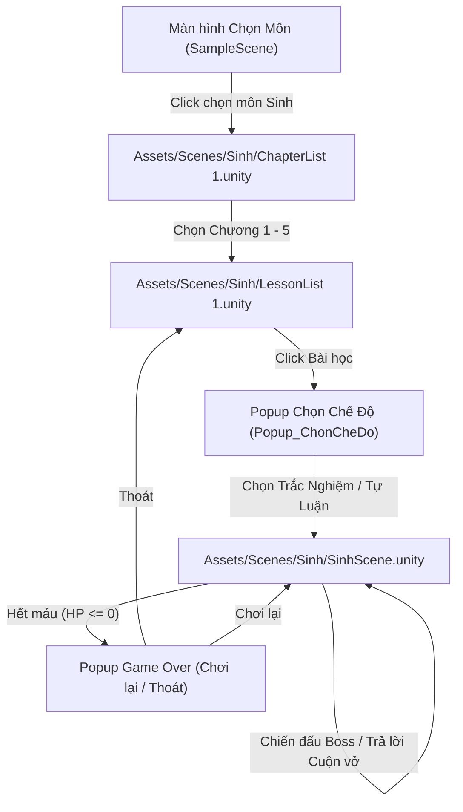

# 🧬 TÀI LIỆU KỸ THUẬT PHÂN HỆ SINH HỌC (BIOLOGY MODULE)
> **Dành cho Leader / Merge Reviewer**  
> **Dự án:** PRU - Educational Game Hub  
> **Nhánh thực hiện:** `basck`  
> **Phạm vi:** Chỉ bao gồm toàn bộ màn chơi, kịch bản, giao diện và tài nguyên thuộc phân hệ **Môn Sinh học (Biology)**.

---

## 📌 1. Tổng quan Luồng Phân hệ Sinh học (Game Flow)



1. **Vào môn Sinh:** Từ màn hình chọn môn học chính, người chơi bấm thẻ **Sinh học** $\rightarrow$ Hệ thống nạp scene `ChapterList 1`.
2. **Chọn Chương:** Hiển thị 5 chương Sinh học THCS. Bấm vào chương nào sẽ lưu `Sinh_SelectedChapter` vào `PlayerPrefs` và chuyển sang `LessonList 1`.
3. **Chọn Bài học & Hình thức thi:**
   - Người chơi click vào bài học cụ thể (Bài 1, Bài 2,... hoặc Ôn tập).
   - Xuất hiện popup bảng gỗ **Chọn hình thức chơi**: **TRẮC NGHIỆM** hoặc **TỰ LUẬN**.
   - Lưu lựa chọn vào `PlayerPrefs` (`Sinh_SelectedLesson`, `Sinh_QuizMode`) $\rightarrow$ Nạp scene gameplay `SinhScene`.
4. **Màn chơi Sinh học (`SinhScene`):**
   - Nhân vật chạy né chướng ngại vật/bẫy trên bản đồ.
   - Gặp Boss $\rightarrow$ Game tạm dừng, mở bảng câu hỏi cuộn vở.
   - Trả lời đúng: Cộng **+10 điểm**, hồi máu theo tỷ lệ, người chơi tấn công và diệt Boss.
   - Hết 3 Boss ban đầu: Kích hoạt **Endless Loop (Vòng lặp vô tận)**, tiếp tục sinh Boss và lặp lại câu hỏi.
   - Hết máu ($HP \le 0$): Xuất hiện Popup thông báo **Hết máu**, điểm số tích lũy, kỷ lục ranking cùng 2 nút: **Chơi lại** và **Thoát**.

---

## 📁 2. Danh sách File & Thư mục Quản lý (Managed Files & Assets)

### 2.1. Danh mục Scene (Thư mục `Assets/Scenes/Sinh/`)
| Tên File | Chức năng | Phụ thuộc chính |
| :--- | :--- | :--- |
| **`ChapterList 1.unity`** | Giao diện chọn chương (Chương 1 đến Chương 5). Nút Quay lại dẫn về menu chọn môn. | `BiologyMenuManager.cs` |
| **`LessonList 1.unity`** | Giao diện chọn bài học và chứa modal popup chọn hình thức (Trắc nghiệm / Tự luận). | `BiologyMenuManager.cs` |
| **`SinhScene.unity`** | Scene gameplay chính: Runner né bẫy, camera bám theo nhân vật, thanh máu, HUD điểm số, bảng câu hỏi cuộn vở và đấu Boss. | `QuizManager.cs`, `ObstacleSpawner.cs`, `PlayerCollision.cs` |

---

### 2.2. Danh mục Script (C# Code)

#### 🔹 1. `Assets/Scripts/UI/BiologyMenuManager.cs` *(Độc lập 100% cho môn Sinh)*
* **Mô tả:** Quản lý toàn bộ giao diện và điều hướng của `ChapterList 1` và `LessonList 1`.
* **Tính năng:**
  * Tự động nhận diện các nút chương (`Btn_Chuong1` .. `Btn_Chuong5`), gán tiêu đề, mô tả và sự kiện click chuyển scene.
  * Tự động căn chỉnh typography (font size, style Bold, khoảng cách padding, màu sắc tương phản cao trên nền gỗ) chuẩn độ phân giải Canvas 1920x1080.
  * Tự động format căn giữa 3 nút trong popup chọn chế độ: **TRẮC NGHIỆM**, **TỰ LUẬN**, **QUAY LẠI**; chống vỡ dòng chữ.
  * Nạp câu hỏi lọc theo `Sinh_SelectedChapter`, `Sinh_SelectedLesson`, `Sinh_QuizMode`.

#### 🔹 2. `Assets/Scripts/QuizManager.cs` *(Gameplay Quiz môn Sinh)*
* **Mô tả:** Quản lý bộ dữ liệu câu hỏi, logic hiển thị cuộn vở, chấm điểm, hồi máu và Game Over.
* **Tính năng:**
  * **Đọc dữ liệu câu hỏi:** Nạp từ file `question.csv` (hỗ trợ cả link Google Sheet online nếu có URL).
  * **Hệ thống tính điểm & Ranking:**
    * Mỗi câu trả lời đúng được cộng **+10 điểm**.
    * Tự động sinh HUD huy hiệu điểm số trực tiếp ở góc trên màn hình (`ScoreHUD_Sinh: 🏆 ĐIỂM: X`).
    * Tự động lưu `Sinh_HighScore`, `Sinh_LastScore` và danh sách lịch sử điểm số (`Sinh_ScoreHistory`) vào `PlayerPrefs` phục vụ bảng xếp hạng.
  * **Cơ chế Vòng lặp câu hỏi vô tận (Endless Questions):** Khi trả lời hết số câu quy định ban đầu hoặc hết danh sách lọc, hàm `ReplenishAnyAvailableQuestions()` sẽ tự nạp lại câu hỏi để người chơi chơi liên tục không bị đứng game.
  * **Kiểm tra đáp án linh hoạt:**
    * Trắc nghiệm: So khớp đáp án lựa chọn A, B, C, D không phân biệt hoa thường.
    * Tự luận: Kiểm tra theo từ khóa (`keywordsTuLuan`) và chuỗi đáp án chuẩn.
  * **Popup Game Over:** Khi $HP \le 0$, tự động hiển thị modal kết thúc hiển thị Điểm tích lũy, Kỷ lục cao nhất, Số Boss đã vượt qua, kèm 2 nút **CHƠI LẠI** (Reload Scene) và **THOÁT** (Về `LessonList 1`).
  * **Tối ưu hiển thị:** Tự động ẩn dòng chữ mờ placeholder thừa, đảm bảo phản hồi kết quả `"ĐÚNG! ..."` hoặc `"SAI! ..."` hiển thị rõ nét trên dòng kẻ cuốn vở.

#### 🔹 3. `Assets/Scripts/ObstacleSpawner.cs` *(Spawning & Endless Boss Loop)*
* **Mô tả:** Sinh chướng ngại vật ngẫu nhiên trên đường chạy và sinh Boss tại các cột mốc vị trí Y.
* **Tính năng mới bổ sung:**
  * **Cơ chế Endless Boss:** Sau khi vượt qua 3 Boss đầu tiên ($Y \ge 100$), hệ thống tự động lặp tiếp tục sinh Boss theo chu kỳ mỗi $40$ đơn vị trục tung ($Y = 140, 180, 220, \dots$) xoay vòng qua các Prefab Boss cho đến khi người chơi hết máu hoặc chủ động thoát màn.

#### 🔹 4. `Assets/Scripts/PlayerCollision.cs` *(Va chạm & Thời gian bất tử)*
* **Mô tả:** Xử lý va chạm giữa nhân vật người chơi với bẫy chướng ngại vật (`Tag: Obstacle`).
* **Tính năng:**
  * Xóa bẫy chướng ngại vật khi va chạm.
  * **Thời gian bất tử tạm thời (`thoiGianHoiMau`):** Mặc định $1$ giây (có thể điều chỉnh trên Inspector). Trong thời gian này, va phải bẫy tiếp theo sẽ không bị trừ máu lặp lại.
  * Kích hoạt hiệu ứng chớp đỏ (`ChopDoHieuUng`) khi bị dính sát thương.
  * Gọi trừ máu thông qua `QuizManager.Instance.TruMau(satThuong)`.

#### 🔹 5. `Assets/Scripts/ObstacleDamage.cs`
* **Mô tả:** Component gắn kèm trên các Prefab chướng ngại vật để quy định phần trăm sát thương trừ máu (`phanTramTruMau`, mặc định 10%).

---

### 2.3. Danh mục Tài nguyên Dữ liệu & Assets (Data & Assets)
* **File dữ liệu câu hỏi:** `Assets/Scenes/Sinh/Sprites/question.csv` (Chứa hơn 200 câu hỏi trắc nghiệm Sinh học THCS gồm Câu hỏi, 4 phương án A-B-C-D, Đáp án đúng, Giải thích chi tiết).
* **Sprites thư mục môn Sinh:** `Assets/Scenes/Sinh/Sprites/`
  * Chứa toàn bộ hình ảnh cuộn vở bảng câu hỏi, các icon nút A, B, C, D, nút Gửi, đồng hồ cát, thanh máu, bẫy chướng ngại vật, nhân vật và quái vật Boss môn Sinh.
* **Tài liệu tham chiếu cấu trúc:** `c_u_tr_c_d_li_u_game_hub.md` (Đặc tả chi tiết cấu trúc bảng Game Hub V1.1 môn Sinh học).

---

## 🔗 3. Điểm Giao Thoa với Hệ thống Chung (Integration Points)

Để Leader dễ dàng kiểm tra khi Merge, phân hệ Sinh học **chỉ kết nối với hệ thống chung tại 2 điểm duy nhất**, hoàn toàn không can thiệp vào code của các thành viên khác:

### 1️⃣ Điểm chuyển Scene từ Menu chính (`Assets/Scripts/MainMenuManager.cs`)
Tại hàm `SelectSubject(string subjectName)`, bổ sung nhánh chuyển hướng vào môn Sinh:
```csharp
else if (lower.Contains("sinh") || lower.Contains("bio"))
{
    SceneManager.LoadScene("ChapterList 1");
}
```

### 2️⃣ Cấu hình Build Settings (`ProjectSettings/EditorBuildSettings.asset`)
Đã đăng ký 3 scene môn Sinh học vào danh sách Scene Build:
```yaml
  - enabled: 1
    path: Assets/Scenes/Sinh/ChapterList 1.unity
  - enabled: 1
    path: Assets/Scenes/Sinh/LessonList 1.unity
  - enabled: 1
    path: Assets/Scenes/Sinh/SinhScene.unity
```

> ⚠️ **Cam kết an toàn tuyệt đối:**
> * File `LoginManager.cs` được giữ nguyên bản gốc 100% của nhóm, không có bất kỳ dòng code nào bị chỉnh sửa.
> * Các scene và script của môn Vật lý (`Physics`) hay môn khác được phân lập namespace riêng (`ScienceQuest.Quiz.QuizManager`), không xảy ra lỗi trùng tên lớp (Ambiguous reference).

---

## 💾 4. Danh sách Biến lưu trữ (PlayerPrefs Keys Used)

| Key | Kiểu | Mô tả mục đích |
| :--- | :---: | :--- |
| `Sinh_SelectedChapter` | `string` | Tên chương môn Sinh được chọn từ `ChapterList 1` |
| `Sinh_SelectedLesson` | `string` | Tên bài học được chọn từ `LessonList 1` |
| `Sinh_QuizMode` | `string` | Hình thức kiểm tra (`TracNghiem` hoặc `TuLuan`) |
| `Sinh_HighScore` | `int` | Điểm kỷ lục cao nhất của người chơi ở môn Sinh |
| `Sinh_LastScore` | `int` | Điểm số của lần chơi gần nhất |
| `Sinh_ScoreHistory` | `string` | Lịch sử 20 lần chơi gần nhất (dùng để render Bảng xếp hạng) |

---

## 🛠️ 5. Hướng dẫn Test Nhanh dành cho Leader khi Merge (Testing Checklist)

1. **Mở Unity:** Mở `Assets/Scenes/SampleScene.unity`, bấm **Play ▶**.
2. **Chọn môn Sinh:** Bấm chọn thẻ **Sinh học** $\rightarrow$ Kiểm tra scene `ChapterList 1` mở lên, chữ rõ nét, nút Quay lại hoạt động bình thường.
3. **Chọn Chương & Bài:** Chọn Chương 1 $\rightarrow$ chọn Bài 1 $\rightarrow$ Popup gỗ hiện lên với 3 nút **TRẮC NGHIỆM**, **TỰ LUẬN**, **QUAY LẠI** cân đối ở giữa.
4. **Vào màn chơi (`SinhScene`):**
   - Nhân vật chạy né bẫy chướng ngại vật; khi va chạm có chớp đỏ và kích hoạt thời gian bất tử 1s.
   - Gặp Boss: Cuộn vở câu hỏi mở ra, hiển thị rõ ràng nội dung câu hỏi, 4 đáp án A, B, C, D.
   - Click chọn đáp án $\rightarrow$ hiển thị chữ vào ô Trả lời $\rightarrow$ Bấm **Gửi** $\rightarrow$ Phản hồi `ĐÚNG! ...` hoặc `SAI! ...` cùng lời giải thích rõ ràng.
   - Trả lời đúng: Được cộng **+10 điểm**, HUD điểm góc trên cập nhật ngay lập tức.
   - Hết 3 Boss ban đầu: Map tự động chạy tiếp và spawn thêm Boss lặp vô tận.
   - Cố tình để hết máu ($HP \le 0$): Popup Game Over hiện ra với thông báo Điểm tích lũy, Kỷ lục cao nhất, 2 nút **Chơi lại** và **Thoát**.
